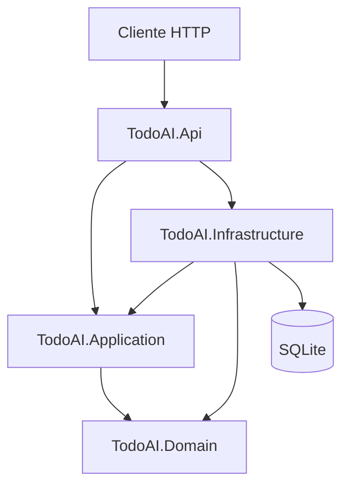

# Arquitetura — TodoAI

## Visão geral

TodoAI é uma API HTTP para gerenciamento de tarefas, organizada em **Clean Architecture** com quatro assemblies principais em `src/` e comunicação interna via **CQRS (MediatR)**.

## Camadas

### Domain (`src/TodoAI.Domain`)

Núcleo do negócio. Contém entidades (`TodoItem`) e invariantes (título obrigatório, transição para concluído). Não conhece banco, HTTP nem MediatR.

### Application (`src/TodoAI.Application`)

Orquestra casos de uso:

- **Commands** e **Queries** (MediatR)
- **Handlers** com dependência apenas de abstrações (`ITodoItemRepository`, `TimeProvider`)
- **DTOs** para resposta à API

Define *ports* (interfaces); a Infrastructure fornece *adapters*.

### Infrastructure (`src/TodoAI.Infrastructure`)

Detalhes técnicos:

- `TodoAiDbContext` (EF Core 10)
- Mapeamentos Fluent API (`Persistence/Configurations/`)
- Migrations em `Persistence/Migrations/`
- `TodoItemRepository` implementando `ITodoItemRepository`
- Extensão `AddInfrastructure` para registro no DI

### Api (`src/TodoAI.Api`)

Ponto de entrada:

- Controllers REST (`TodosController`)
- OpenAPI em Development (`MapOpenApi`)
- Composition root: `AddApplication()`, `AddInfrastructure()`, `TimeProvider.System`, aplicação de migrations em Development

## Fluxo de uma requisição (exemplo: criar tarefa)

1. `POST /api/todos` → `TodosController`
2. Controller envia `CreateTodoCommand` via `IMediator`
3. `CreateTodoCommandHandler` cria `TodoItem` no domínio e persiste via `ITodoItemRepository`
4. Handler retorna `TodoItemDto`
5. Controller responde `201 Created`

## CQRS

| Tipo | Exemplo | Responsabilidade |
|------|---------|------------------|
| Query | `GetTodosQuery` | Leitura, sem alterar estado |
| Command | `CreateTodoCommand` | Escrita, persistência via repositório |

Handlers ficam co-localizados com o request (`Commands/CreateTodo/`, `Queries/GetTodos/`).

## Persistência

- Provedor: **SQLite** (arquivo `todoai.db` por padrão)
- Migrations versionadas no projeto Infrastructure
- Tabela `todo_items` mapeada por `TodoItemConfiguration`

## Testes

Projetos em `tests/` espelham as camadas:

- Domínio: testes unitários puros
- Application: mocks de repositório (**Moq**)
- Infrastructure: integração leve com EF + SQLite
- Api: smoke sobre o assembly (expandir para integração HTTP quando necessário)

## Decisões documentadas

| ADR | Tema |
|-----|------|
| [ADR-001](docs/adr/ADR-001-clean-architecture.md) | Clean Architecture |
| [ADR-002](docs/adr/ADR-002-cqrs-mediatr.md) | CQRS + MediatR |
| [ADR-003](docs/adr/ADR-003-sqlite-efcore.md) | SQLite + EF Core |

## Evolução prevista

- Comandos: concluir, atualizar, excluir tarefa
- Validação com FluentValidation (opcional, via pipeline MediatR)
- Autenticação/autorização quando necessário
- Health checks e observabilidade
